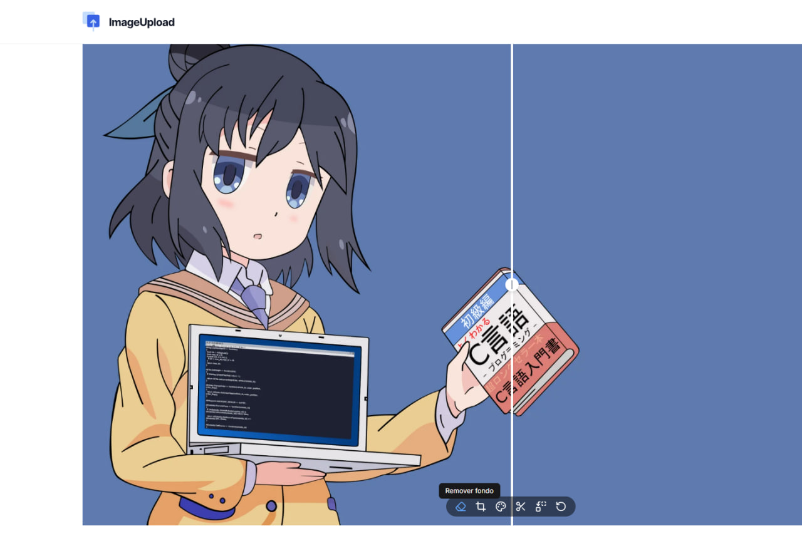

# Image Upload and Editor

## Descripción

Este proyecto es una aplicación web que permite a los usuarios cargar imágenes y editarlas utilizando la API de Cloudinary. Ofrece una interfaz de arrastrar y soltar para la carga de imágenes, así como un editor de imágenes integrado para realizar ajustes y modificaciones.



- [Instalación](#instalación)
- [Uso](#uso)
- [Características](#características)
- [Configuración](#configuración)
- [Tecnologías Utilizadas](#tecnologías-utilizadas)
- [Contribución](#contribución)
- [Licencia](#licencia)
- [Estado del Proyecto](#estado-del-proyecto)

## Instalación

Para instalar y ejecutar este proyecto localmente, sigue estos pasos:

1. Clona el repositorio:

   ```bash
   git clone [URL_DEL_REPOSITORIO]
   ```

2.Instala las dependencias:

```bash
bun install
```

3. Configura las variables de entorno:
   Copia el archivo `.example.env` a `.env.local` y completa las credenciales de Cloudinary requeridas:

   ```bash
   NEXT_PUBLIC_CLOUDINARY_CLOUD_NAME=tu_cloud_name
   CLOUDINARY_API_KEY=tu_api_key CLOUDINARY_API_SECRET=tu_api_secret
   CLOUDINARY_URL=tu_cloudinary_url
   NEXT_PUBLIC_CLOUDINARY_API_KEY=tu_public_api_key
   ```

4. Ejecuta el servidor de desarrollo:

   ```bash
   bun run dev
   ```

5. Abre [http://localhost:3000](http://localhost:3000) en tu navegador para ver el resultado.

## Estructura del Proyecto

- `/src/app`: Contiene las páginas principales de la aplicación y los layouts
- `/src/components`: Componentes React reutilizables
- `/src/actions`: Acciones del servidor para el servicio de Cloudinary
- `/src/lib`: Funciones de utilidad y bibliotecas compartidas

## Uso

1. Navega a la página principal
2. Utiliza la interfaz de arrastrar y soltar o haz clic para seleccionar una imagen para cargar
3. Una vez cargada, usa el editor de imágenes para hacer los ajustes necesarios
4. Guarda tus cambios y gestiona tus imágenes cargadas

## Contribuir

¡Las contribuciones son bienvenidas! No dudes en enviar un Pull Request.

1. Haz un fork del proyecto
2. Crea tu rama de características (`git checkout -b feature/CaracteristicaIncreible`)
3. Haz commit de tus cambios (`git commit -m 'Añadir alguna CaracteristicaIncreible'`)
4. Haz push a la rama (`git push origin feature/CaracteristicaIncreible`)
5. Abre un Pull Request

## Licencia

Este proyecto está licenciado bajo la Licencia MIT - ver el archivo [LICENSE.md](LICENSE.md) para más detalles.

## Agradecimientos

- [Documentación de Next.js](https://nextjs.org/docs)
- [Documentación de Cloudinary](https://cloudinary.com/documentation)
- [Documentación de Tailwind CSS](https://tailwindcss.com/docs)
- [Componentes de shadcn/ui](https://ui.shadcn.com/)

## Contacto

Epsaind - [@tutwitter](https://twitter.com/tutwitter) - email@ejemplo.com

Enlace del Proyecto: [https://github.com/tuusuario/upload-image](https://github.com/LostoVayne/upload-image)
